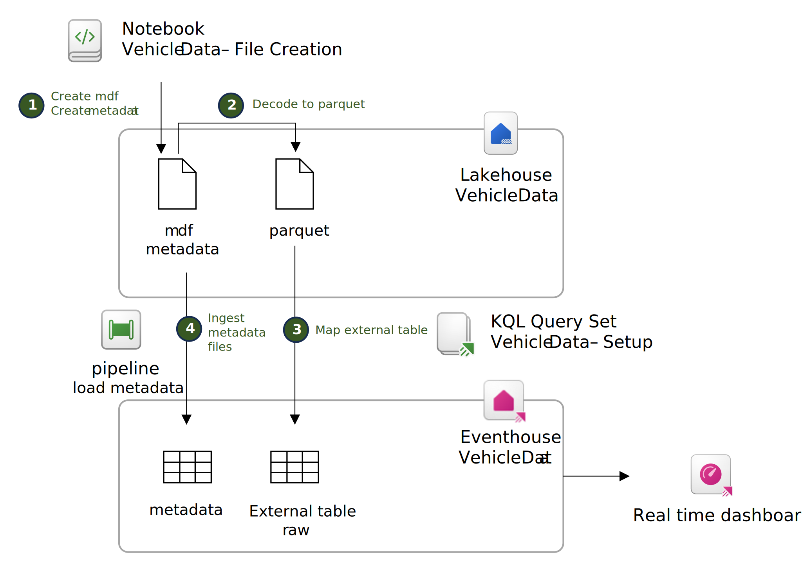

# Using Fabric to analyze MDF files

This document will walk you through the necessary steps to analyze MDF files in Fabric. We will generate sample MDF files using the *asammdf* library, generate partitioned parquet files and load them in an Eventhouse for analytics with some sample queries. We will also display the resulting information in a Real Time Dashboard.

## Step Overview

- Get a free Fabric trial and create a workspace
- Create the necessary resources
  - Create an Environment that supports asammdf to generate MDF Files
  - Create a Lakehouse to host the parquet files
  - Create an Eventhouse to perform Real Time Analytics
- Setup your Eventhouse using the Vehicle Data - Setup KQL Queryset

1. Generate synthetic MDF and metadata files.
1. Decode the files into parquet.
1. Map an external table to load the parquet files in Event House.
1. Set up a pipeline to ingest the metadata files.
1. Visualize the results.

## Initial Setup

- Get a [Microsoft Fabric trial capacity](https://learn.microsoft.com/fabric/get-started/fabric-trial) to get started with Fabric
- [Create a workspace in Fabric](https://learn.microsoft.com/fabric/get-started/create-workspaces) and use a suitable name, for example *Automotive Engineering Data*

## Create the necessary resources

We will create a spark environment that has the necessary automotive libraries, a lakehouse to store raw MDF recordings and a eventhouse to store metadata and signal data.

- Create a new environment item called *AutomotiveEnvironment* and add the *asammdf* library from PyPI
  - In the environment, go to the entry "Public Libraries" and press "+ Add from PyPI" on the top bar.
  - Type asammdf and select the library
  - Select the "publish" option
  - Wait until the publication process is complete.
- [Create a Lakehouse](https://learn.microsoft.com/fabric/data-engineering/create-lakehouse) and call it *VehicleData*. The Lakehouse will store the MDF and the parquet files.
- [Create a new Eventhouse](https://learn.microsoft.com/fabric/real-time-intelligence/create-eventhouse) item and call it *VehicleData*. The Eventhouse will have a KQL Database to store the metadata and the signal information.

## Generate sample MDF files and process them

- Import the [Vehicle Data - File Creation](Vehicle%20Data%20-%20File%20Creation.ipynb) notebook to the workspace
  - Select the previously created *AutomotiveEnvironment* as the execution environment from the toolbar
  - Execute the cell *Create a Sample MDF File* to create a sample MDF file. This file will be stored in the Lakehouse
  - Execute the cell *Create metadata file*. This will create the associated metadata file to the recording.
  - Execute the cell *Decode the MDF file to parquet*. This will transform MDF files into a format suitable for analytics (parquet).

## Setup your eventhouse

- Create a KQL Query Set item with the name "Vehicle Data - Setup" and add the code from the [KQL Setup file](Vehicle%20Data%20-%20Setup.kql)
  - Execute the code to create the *raw* external table.
- Create a pipeline *load-metadata* to automatically import the metadata files into the metadata table

## Execute some sample queries

- Create a KQL Query set item with the name *Vehicle Data - Sample Queries and add the code from [Vehicle Data - Sample Queries](Vehicle%20Data%20-%20Sample%20Queries.kql)
  - Read the description and execute teh queries

## Visualize the data a Real Time DAshboard

- Import the [Real Time Dashboard](dashboard-Automotive%20Engineering%20Data.json)

## Clean up

- Delete the workspace from Microsoft Fabric to clear all resources.
